

# A11G Final Submission

**Team Number:** 8

**Team Name:** Shake Awake

**GitHub Repository URL:** [https://github.com/ese5160/final-project-firmware-s26-t08-shake-awake](https://github.com/ese5160/final-project-firmware-s26-t08-shake-awake)

| Team Member Name  | Email Address          | GitHub Handle |
| ----------------- | ---------------------- | ------------- |
| William Hatfield  | hatwill@seas.upenn.edu | whatfield     |
| Christian Durante | cgd2@seas.upenn.edu    | Chris-Durante |

## 1. Video Presentation

[https://youtu.be/FDqjJD4r2T0](https://youtu.be/FDqjJD4r2T0)

## 2. Project Summary

### Device Description

Our prototype is an alarm clock that is motion de-activated to ensure a more effective start to the morning. The impetus for this design was twofold. We had the idea to improve on alarms that people normally use to wake up by forcing the user to actively participate in turning off the alarm. We would then track how long it took for the user to wake up, in addition to environmental data. Many people have issues with managing their sleep schedule, and this device was intended to help people find out what environments allow them to wake up with more energy. The device  is connected to the cloud in order to both track user performance as well as environmental data to keep users aware of their sleeping habits and what improvements they can make in their environment.

### Device Functionality

Beyond the core functionalities of an alarm clock, the centralmost component to our device is its fleet of sensors, most of which an inertial measurement unit (IMU). The IMU is used to measure both linear and angular movement across 3 degrees of freedom each. Values from this sensor are collected and contribute to a “running average” to determine that the user is actively moving the device for a prolonged period of time, filtering noise or accidental movement. In addition to the IMU, a light sensor and a temperature sensor capture data about the device’s surrounding environment. Raw inputs are filtered and converted to human-readable units before being transmitted to the Node-RED cloud interface.

In addition to this interface, actuators are used to give presence and utility to the physical prototype. An LCD displays the current time and can be updated via the cloud. Lastly, a speaker mounted inside the casework signals the alarm until the device is sufficiently moved.

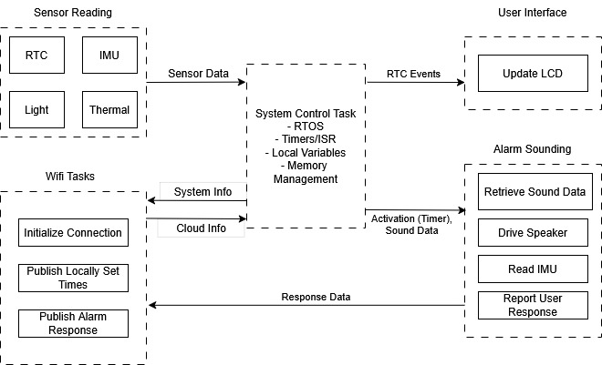

### Challenges

**Hardware**

The first and most time-consuming hardware challenge we faced was that we were not able to communicate with either of our board’s high-power I2C instances, in our case handling the IMU and real-time clock (RTC). After some testing, we could not get either to send an ACK despite accessing proper addresses, indicating an issue with hardware. Fortunately there was a backup option born from an attempt to save space in layout: an additional connector placed in parallel to one of our high-power I2C buses in place of test points. We were then able to use an off-board IMU dev board with the corresponding Sparkfun Qwiic connector to replace the on-board IMU. We desoldered the jumpers to disconnect the on-board IMU from the SDA and SCL lines. The RTC, sharing the same issue on the IMU as a high-power I2C instance, was effectively replaced using the external crystal from the starter project common to each team's design.

**[F]()irmware**

The other overarching challenge we faced was integrating our drivers into a single RTOS project. We faced several different conflicts when attempting to add RTOS to a non-RTOS project. Most notably, a flag used in initializing the built-in “BJT Temperature Sensor” software component exhibited latching behavior when adding RTOS functionality to many exhibit projects (blank C, blinky), causing execution to hang on startup.  This was resolved by starting our project from assignment A08G’s existing RTOS structure.

Finally, we faced issues when integrating the OTAFU into RTOS. We added this functionality last, after all of our other tasks, which created conflicts and race conditions that we did not foresee. Through testing, we discovered conflicts with the display task and the firmware update task, which we used mutexes to resolve. These two software challenges together imposed additional time costs that were ultimately felt in not integrating the ordered keypad or fan. These components were chosen as their exclusion were either immaterial to device performance or were out-performed by the node-RED dashboard.

### Prototype Learning

Through building and testing the prototype we saw that adding the OTAFU last made it more difficult to debug the issues and conflicts with other RTOS tasks. It would have been more efficient to start by adding these costly or potentially blocking elements (OTAFU and MQTT), followed by adding the sensor and actuator tasks one by one so we could more effectively find and resolve the conflicts between each task. Writing the code this way would likely have allowed us to identify any potential issues as we added each thread, dealing with any issues immediately, rather than having to find all of the issues once we added the OTAFU.

Another lesson we learned is that adding as many test points as possible in a prototype PCBA is always useful, particularly for peripherals with leadless packaging. Our IMU came in a packaging without leads, making it difficult to evaluate the application circuit. We were able to use the Qwiic connector we added to debug the I2C, but having extra test points to pinpoint where the issues in the circuit were specifically would have been useful. While they were avoided in layout to save some space and headache, If we were to build the device again, we would have tried to add test points to some of the more risky application circuits.

### Next Steps and Takeaways

**Next Steps:**

The next step to improve the device would be to display the date on the LCD, as well as allow the user to change the current date and alarm date through Node-RED. This improvement would be critical if we wanted to move forward with the design. A second improvement would be to improve the criteria for alarm deactivation within the IMU task. As it is, the user just needs to shake the device to turn off the alarm. We could use the other acceleration axes along with the gyroscope to detect gestures, such as when the user gets up and starts walking. To extend further, we could use machine learning to analyze the gait of a user and adapt the criteria. This change would force the user to be even more active in order to turn off the alarm, allowing the collected data to better reflect restfulness.

A less critical change would be to add a table on the Node-RED frontend to more clearly associate wake up time and environmental data with their corresponding alarm in one place. This change would allow the user to more easily see their performance over time. We could also add user input buttons that toggles between different display screens, including date and time, next alarm, and environmental data. Another minor improvement would be to allow the user to customize the alarm audio by uploading files on Node-RED as the SIWG917’s relatively high memory capacity would allow for communicating audio as cumbersome but simply transmitted binary buffers.

**ESE5160 Takeaways:**

In ESE5160, we learned how to design the power architecture for our prototype idea, including calculating current usage and choosing the necessary regulators we required for our device idea. We then had to create schematics for our device. Designing application circuits for each of our sensors and actuators allowed us to learn more about the best practices when designing these types of circuits. We also became more familiar with schematic capture in Altium. We learned about many of the critical aspects of PCB design, including signal integrity, power planes, and analog vs digital sensor considerations. We applied these concepts to our custom PCB, where we learned about laying our switching regulators, differential pairs, and high speed traces such as SPI. We also had to consider the limited space we had on our PCB, and placement of each of our peripheral devices to ensure our analog and digital devices were separated, among other considerations. Another consideration was how much current we were carrying across different areas of the PCB, and ensuring our traces and polygons were capable of carrying that current.

 Once we finished PCB layout and ordered the PCBs, focus shifted to firmware development in the simpler context of the development boards for the SI917x, especially implementing RTOS. We learned about RTOS in more depth, and the ways we could communicate between threads and share resources in order to prepare for the more complex system architecture of our device design. We later learned about cloud communication, and how we could use protocols like MQTT to communicate over WiFi.

When we received our PCBs, focus shifted to bring-up: how to test hardware on a PCB without risking damage to the board, including evaluating power regulators and performing load testing. We then had hands-on practice by interfacing with sensors on the PCBAs to test whether the hardware serviced by those power regulators works as intended. Once we had all our peripherals working or found adequate replacements, we applied what we learned about RTOS and cloud communication earlier in the semester to implement our system’s firmware architecture.

### Project Links

Node RED:

http://52.247.5.204:1880/dashboard/

Altium:

https://upenn-eselabs.365.altium.com/designs/017B68EE-0638-4138-B759-573CDCC668E1

## 3. Hardware and Software Requirements

### 3.1 Hardware Requirements Specification (HRS)

| ID     | Description                                                                                                                                                  |
| ------ | ------------------------------------------------------------------------------------------------------------------------------------------------------------ |
| HRS-01 | A 6-axis IMU shall be used for movement detection. It should detect when the user has stood up and started walking.                                          |
| HRS-02 | A speaker be used to make a noise of at least 70 dB. The PWM signal used to drive the speaker should be customizable.                                        |
| HRS-03 | An LCD screen can display current time as well as both cloud (weather) and local (temperature, light sensors) environmental data                             |
| HRS-04 | The 917 MCU should be used as the sole microcontroller.                                                                                                      |
| HRS-05 | The device shall use a single-cell, 3.7 V, 2200mAh Lithium ion battery                                                                                       |
| HRS-06 | The device should have a battery life of at least 8  hours.                                                                                                  |
| HRS-07 | The device should have at least two buttons that directly toggle the settings of the clock (offline configuration of clock and alarm time, dark/light mode). |
| HRS-08 | The device should gather additional environmental data in real time with temperature and light sensors                                                       |

### 3.2 HRS Evaluation

| ID     | HRS Goal             | Success    | Measurement / Discussion                                                                                                                                                                     |
| ------ | -------------------- | ---------- | -------------------------------------------------------------------------------------------------------------------------------------------------------------------------------------------- |
| HRS-01 | Movement Detection   | Complete   | Refer to [ IMU dev board datasheet](https://cdn.sparkfun.com/assets/c/f/9/d/1/lsm6dso_datasheet.pdf)                                                                                            |
| HRS-02 | Speaker Noise        | Partial    | Speaker noise measured to be at least 70 dB, is not customizable. Reference: [https://youtube.com/shorts/KzBlNMMjUEQ?feature=share](https://youtube.com/shorts/KzBlNMMjUEQ?feature=share) |
| HRS-03 | LCD Screen           | Complete   | Display updates in real time to show new time or alarm timings sent from the cloud                                                                                                           |
| HRS-04 | MCU Choice           | Complete   | Existential, no additional controllers or processor dev boards used                                                                                                                          |
| HRS-05 | Battery Choice       | Complete   | Existential, case work modelled around this particular battery pack shape                                                                                                                    |
| HRS-06 | Battery Life         | Complete   | Typcial current usage of 122.89 mA provides an expected battery life of 17.9 hrs, 223% of target                                                                                            |
| HRS-07 | Button Configuration | Incomplete | Node-RED functionality deemed faster and more crtical, keypad integration generally is a future step                                                                                         |
| HRS-08 | Environmental Data   | Complete   | See Node-RED dashboard (video demonstration)                                                                                                                                                 |

### 3.2 Software Requirements Specification (SRS)

| ID     | Description                                                                                                                                            |
| ------ | ------------------------------------------------------------------------------------------------------------------------------------------------------ |
| SRS-01 | The IMU 3-axis acceleration and gyroscope data shall be measured with 16-bit depth every 100 milliseconds +/-10 milliseconds.                          |
| SRS-02 | The IMU shall be controlled via I2C communication                                                                                                      |
| SRS-03 | The software shall store activity data (time to turn off, temperature, ambient light) to display on-device, and to send to the cloud                   |
| SRS-04 | The software shall be designed with and controlled by FreeRTOS in order to achieve consistent operation and extensibility of the code base.            |
| SRS-05 | The software will update the display according to a series of nested state-machines, allowing users to control various menus with a keypad or buttons. |
| SRS-06 | The software tracks local environmental data (temperature, ambient light), and displays it along with the time.                                        |
| SRS-07 | The device should be able to store and play customizable audio files, uploaded directly or wirelessly.                                                 |
| SRS-08 | The software should filter user movements such that noise and simply picking up the device do not turn off the alarm.                                  |

### 3.4 SRS Evaluation

| ID     | HRS Goal               | Success    | Measurement / Discussion                                                                                                               |
| ------ | ---------------------- | ---------- | -------------------------------------------------------------------------------------------------------------------------------------- |
| SRS-01 | IMU Polling            | Complete   | Refer to [ IMU dev board datasheet](https://cdn.sparkfun.com/assets/c/f/9/d/1/lsm6dso_datasheet.pdf), as well as IMU code snippets below. |
| SRS-02 | IMU Control            | Complete   | Existential, refer to codebase                                                                                                         |
| SRS-03 | Edge Computing         | Complete   | Video demonstration shows Node-RED integration                                                                                         |
| SRS-04 | RTOS                   | Complete   | Refer to codebase                                                                                                                      |
| SRS-05 | Menus (State Machines) | Incomplete | Keypad integration forgone, see Button Configuration HRS                                                                               |
| SRS-06 | Environmental Data     | Partial    | Displayed only on Node-RED, not on-device display                                                                                      |
| SRS-07 | Custom Audio           | Incomplete | Custom audio uploads were prohibitively blocking during firmware development, at least within bounds of course timeline                |
| SRS-08 | Noise Rejection        | Complete   | Demonstrated in video, code snippet attached                                                                                           |

#### IMU Code Snippets

Initialization:
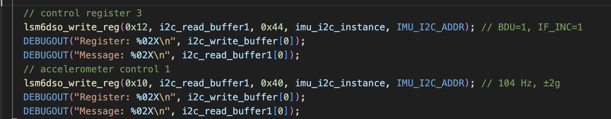

RTOS Function:
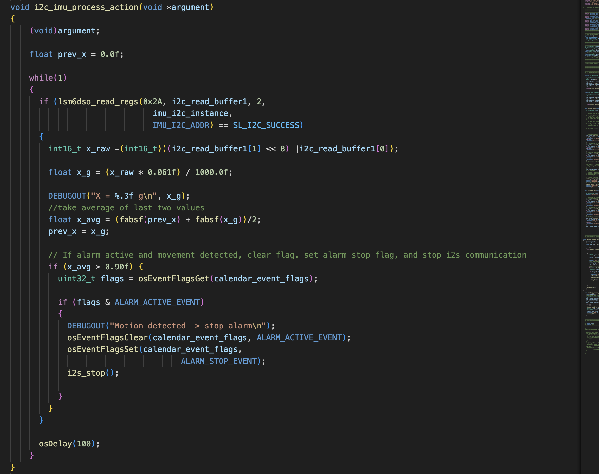

## 4. Project Photos

Final Prototype

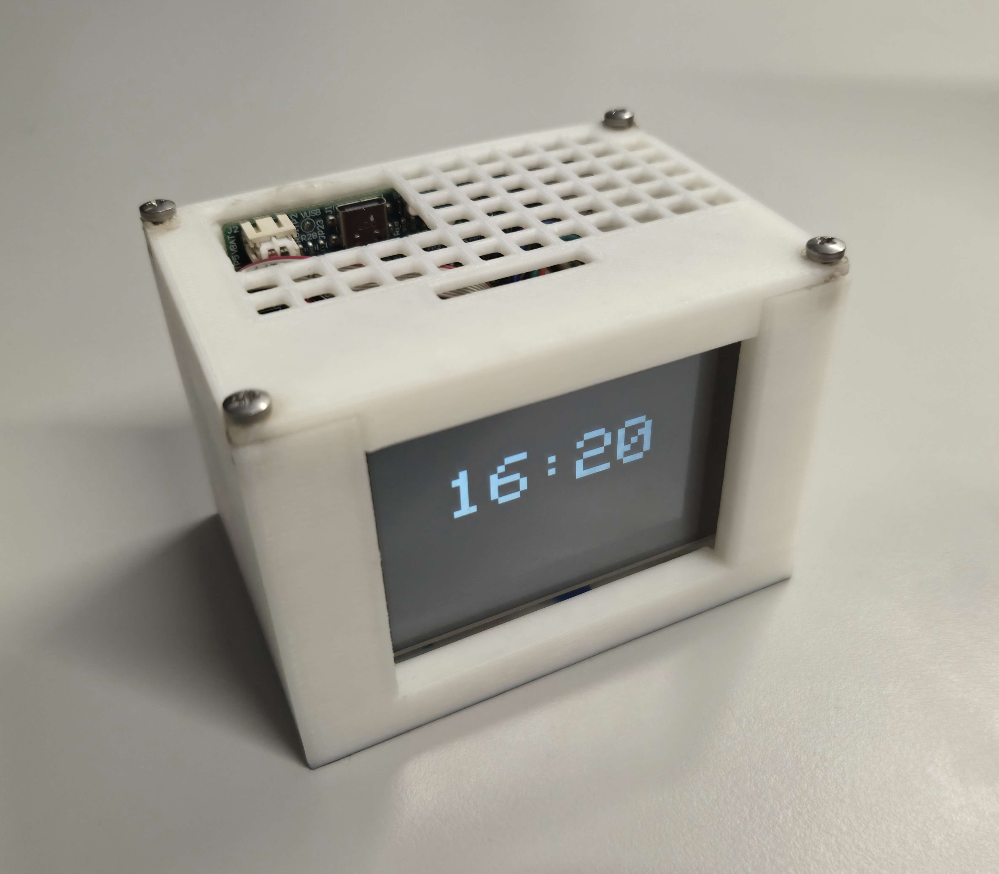

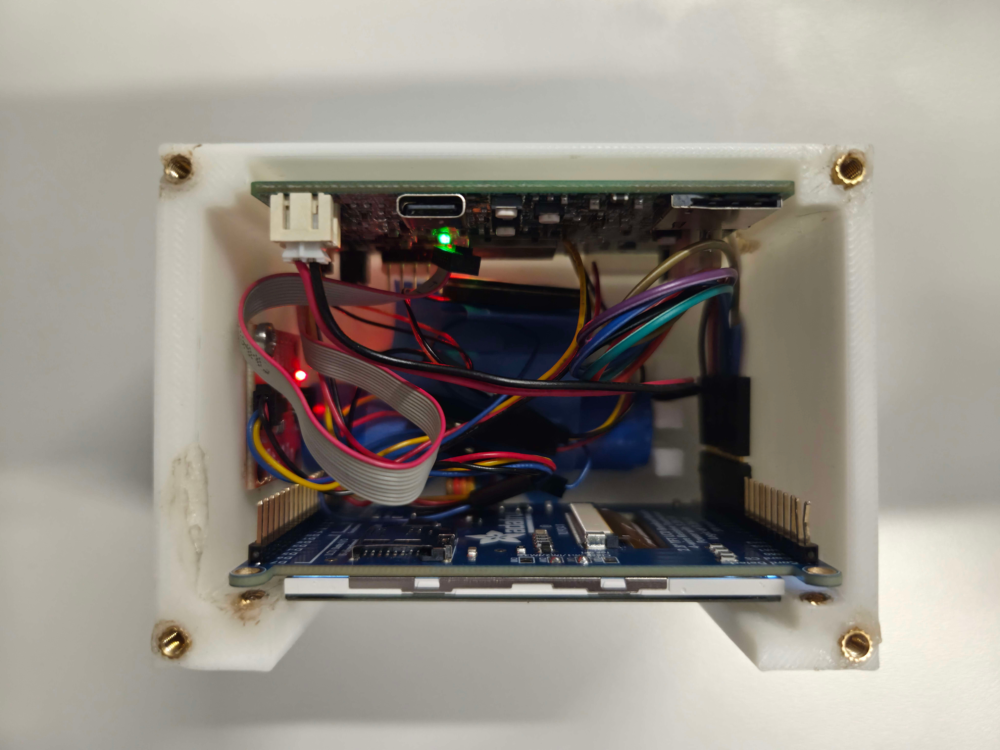

PCBA, top

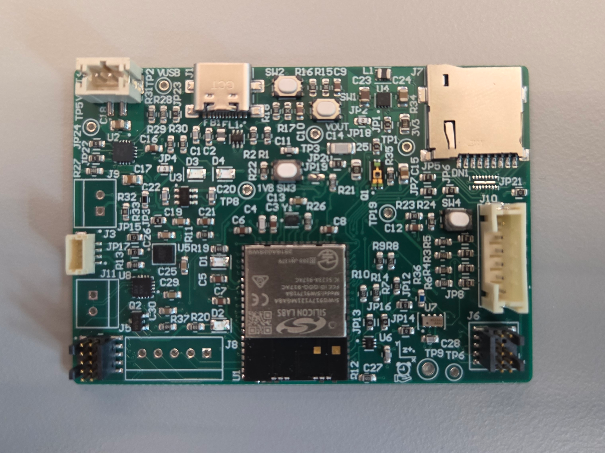

PCBA, bottom

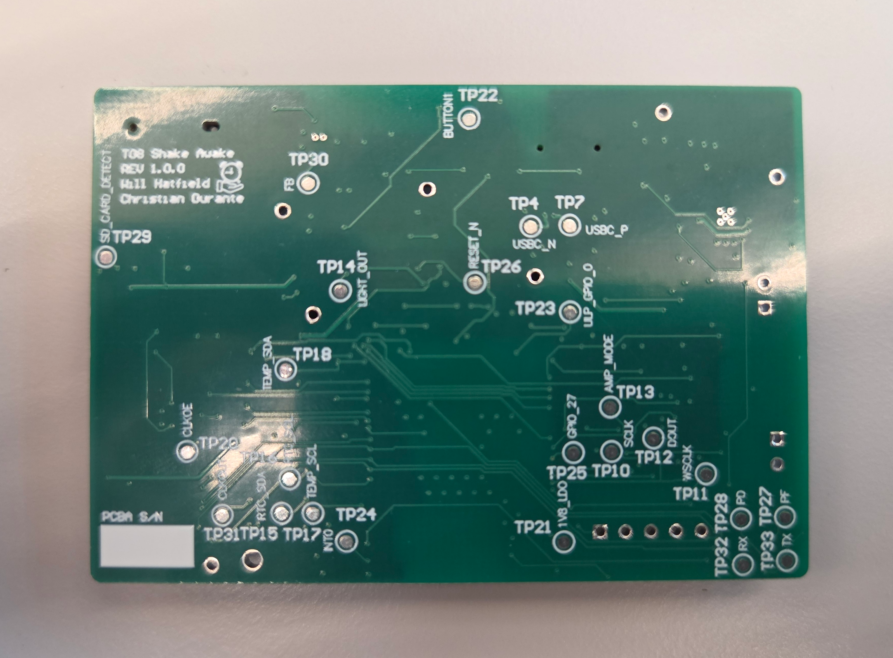

Thermal Performance

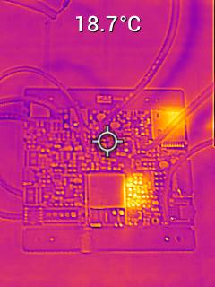

Altium Design 2D

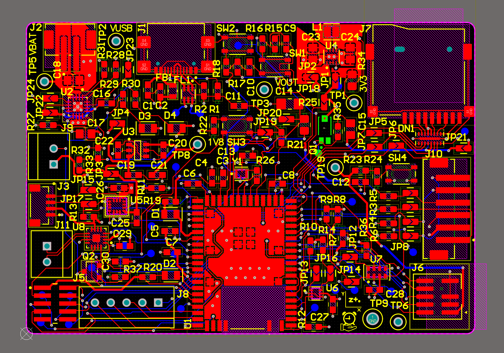

Altium Design 3D

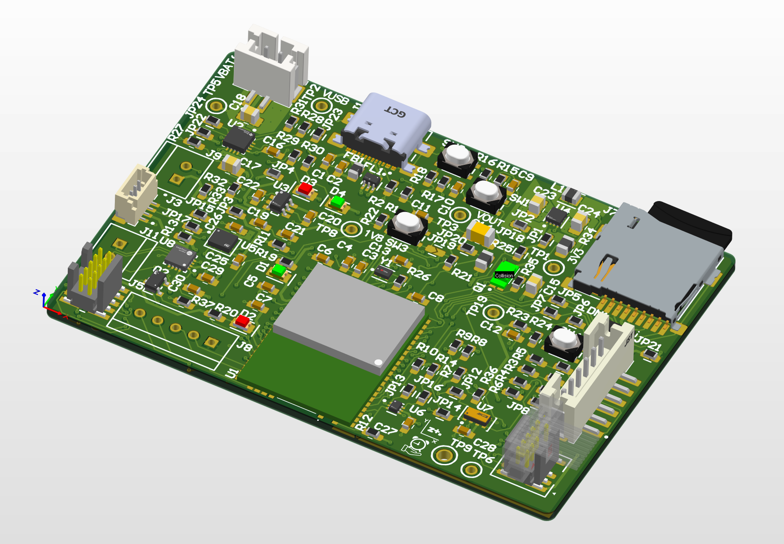

Node-RED Dashboard

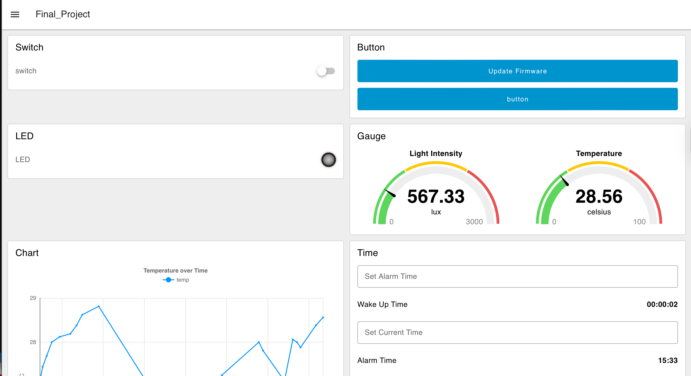

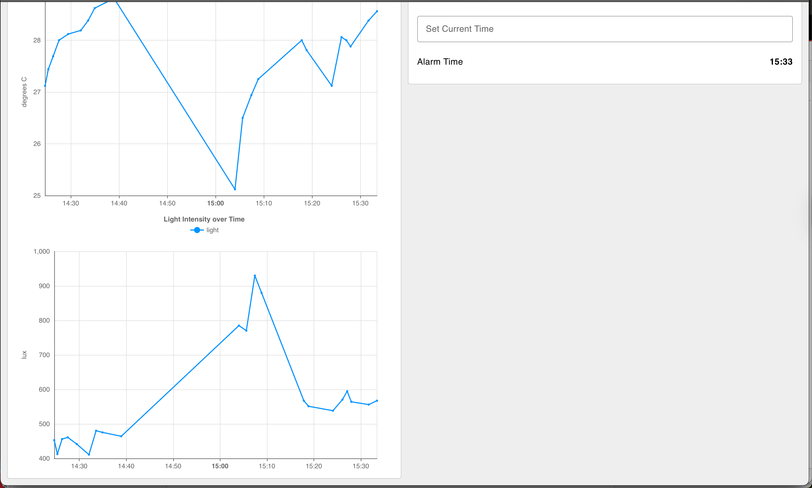

Node-RED Backend

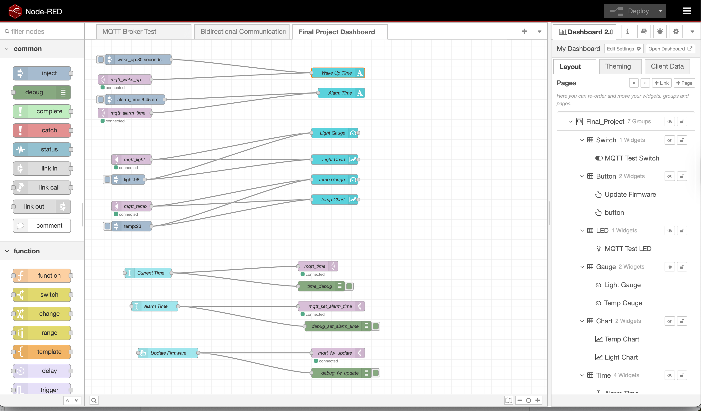

Block Diagram

## 5. Codebase

Description of file structure

Locations of Node-Red Dashboard File
